# System Archit

ecture Mind Map & Workflow

## Overview

This document provides a comprehensive visualization of all services, connections, and processes that build, run, and maintain the Professional Diver Training Platform.

## Architecture Diagram

```mermaid
flowchart TB
    subgraph "Development Environment"
        DEV[Local Development<br/>localhost:3000/5000]
        SQLITE[(SQLite DB<br/>local-dev.db)]
        VITE[Vite Dev Server<br/>Port 3000]
        EXPRESS[Express API<br/>Port 5000]
    end

    subgraph "Version Control & CI/CD"
        GITHUB[GitHub Repository<br/>lalabalavujon-a11y/Professional-Diver.app]
        GHA_CI[GitHub Actions CI<br/>.github/workflows/ci.yml]
        GHA_DEPLOY[GitHub Actions Deploy<br/>.github/workflows/deploy.yml]
        GHA_EMAIL[GitHub Actions Email<br/>.github/workflows/email-campaigns.yml]
    end

    subgraph "Deployment Platforms"
        CLOUDFLARE[Cloudflare Workers<br/>professionaldiver.app]
        RAILWAY[Railway.app<br/>Backend Hosting]
        CF_MAIN[Main Worker<br/>professionaldiver-app-production]
        CF_API[API Worker<br/>professionaldiver-api-production]
        CF_KV[Cloudflare KV<br/>Caching & Data]
        CF_D1[Cloudflare D1<br/>SQLite Database]
    end

    subgraph "Database Services"
        SUPABASE[(Supabase PostgreSQL<br/>Production Database)]
        NEON[(Neon PostgreSQL<br/>Alternative/Backup)]
        DATABASE_URL[DATABASE_URL<br/>Connection String]
    end

    subgraph "AI Services"
        OPENAI[OpenAI API<br/>GPT-4o, Embeddings, TTS]
        LANGSMITH[LangSmith<br/>AI Observability & Learning]
        LANGCHAIN[LangChain<br/>AI Orchestration]
        LAURA[Laura Oracle<br/>Super Platform Oracle]
        DIVER_WELL_PLATFORM[Diver Well Platform<br/>Commercial Diving Consultant]
        DIVER_WELL_GPT[Diver Well GPT<br/>OpenAI GPT Version]
        AI_TUTORS[AI Tutors<br/>9 Discipline Specialists]
    end

    subgraph "CRM & Marketing"
        GHL[GoHighLevel GHL<br/>CRM Integration]
        GHL_OAUTH[GHL OAuth<br/>Authentication]
        GHL_AI[GHL AI Bridge<br/>Lead Qualification]
    end

    subgraph "Payment Processing"
        STRIPE[Stripe<br/>Payment Processing]
        PAYPAL[PayPal<br/>Payment Processing]
        REVOLUT[Revolut<br/>Payment Processing]
    end

    subgraph "Email Services"
        SENDGRID[SendGrid<br/>Email Delivery]
        SMTP[SMTP Server<br/>Google Workspace]
        NODEMAILER[Nodemailer<br/>Email Client]
    end

    subgraph "Storage Services"
        GCS[Google Cloud Storage<br/>File Storage]
        UPPY[Uppy<br/>File Upload]
        AWS_S3[AWS S3<br/>via Uppy]
    end

    subgraph "Analytics & Tracking"
        GA4[Google Analytics 4<br/>GA4_MEASUREMENT_ID]
        FB_PIXEL[Facebook Pixel<br/>Tracking]
        BEHAVIOR_MONITOR[Behavior Monitoring<br/>User Behavior Analytics]
    end

    subgraph "Background Workers & Automation"
        EMAIL_WORKER[Email Campaign Worker<br/>GitHub Actions Scheduled]
        PAYMENT_WORKER[Payment Processing Workers<br/>Stripe/PayPal/Revolut Webhooks]
        AFFILIATE_WORKER[Affiliate Payout Worker<br/>Automated Commission Processing]
        ENGAGEMENT_WORKER[Student Engagement Monitor<br/>GHL AI Bridge]
        BACKUP_WORKER[Backup Worker<br/>Automated Database Backups]
        CODE_MONITOR[Super Debug Agent<br/>Code Quality Monitoring]
        PLATFORM_SCANNER[Platform Scanner<br/>Continuous Management]
        LANGCHAIN_WORKER[LangChain Background Agents<br/>Vector Indexing & Learning]
        HEALTH_MONITOR[Health Monitor<br/>System Health Checks]
    end

    subgraph "Build Tools"
        NPM[NPM/pnpm<br/>Package Manager]
        VITE_BUILD[Vite Build<br/>Frontend Bundle]
        TSX[TSX<br/>TypeScript Execution]
        DRIZZLE[Drizzle ORM<br/>Database Migrations]
    end

    subgraph "Mobile Apps"
        CAPACITOR[Capacitor<br/>Mobile Framework]
        IOS[iOS App]
        ANDROID[Android App]
    end

    %% Development Flow
    DEV --> VITE
    DEV --> EXPRESS
    EXPRESS --> SQLITE
    VITE --> EXPRESS

    %% Version Control
    DEV --> GITHUB
    GITHUB --> GHA_CI
    GITHUB --> GHA_DEPLOY
    GITHUB --> GHA_EMAIL

    %% Deployment Flow
    GHA_DEPLOY --> CLOUDFLARE
    GHA_DEPLOY --> CF_MAIN
    GHA_DEPLOY --> CF_API
    RAILWAY --> EXPRESS
    CF_MAIN --> CF_API
    CF_MAIN --> CF_KV
    CF_MAIN --> CF_D1
    CF_API --> CF_D1

    %% Database Connections
    CF_MAIN --> DATABASE_URL
    CF_API --> DATABASE_URL
    RAILWAY --> DATABASE_URL
    DATABASE_URL --> SUPABASE
    DATABASE_URL --> NEON
    DRIZZLE --> SUPABASE
    DRIZZLE --> NEON

    %% AI Integration
    LAURA --> OPENAI
    LAURA --> LANGSMITH
    LAURA --> LANGCHAIN
    DIVER_WELL_PLATFORM --> OPENAI
    DIVER_WELL_PLATFORM --> LANGSMITH
    DIVER_WELL_PLATFORM --> LANGCHAIN
    DIVER_WELL_GPT --> OPENAI
    AI_TUTORS --> OPENAI
    AI_TUTORS --> LANGCHAIN
    GHL_AI --> LAURA
    GHL_AI --> OPENAI
    LANGCHAIN --> LANGSMITH

    %% CRM Integration
    GHL_AI --> GHL
    LAURA --> GHL
    GHL --> GHL_OAUTH

    %% Payment Integration
    CF_MAIN --> STRIPE
    CF_MAIN --> PAYPAL
    CF_MAIN --> REVOLUT

    %% Email Integration
    GHA_EMAIL --> SENDGRID
    GHA_EMAIL --> SMTP
    CF_MAIN --> SENDGRID
    CF_MAIN --> NODEMAILER
    NODEMAILER --> SMTP
    NODEMAILER --> SENDGRID

    %% Storage Integration
    CF_MAIN --> UPPY
    UPPY --> AWS_S3
    CF_MAIN --> GCS

    %% Analytics
    CF_MAIN --> GA4
    CF_MAIN --> FB_PIXEL
    CF_MAIN --> BEHAVIOR_MONITOR

    %% Background Workers
    GHA_EMAIL --> EMAIL_WORKER
    EMAIL_WORKER --> SENDGRID
    EMAIL_WORKER --> SMTP
    STRIPE --> PAYMENT_WORKER
    PAYPAL --> PAYMENT_WORKER
    REVOLUT --> PAYMENT_WORKER
    PAYMENT_WORKER --> AFFILIATE_WORKER
    AFFILIATE_WORKER --> STRIPE
    AFFILIATE_WORKER --> PAYPAL
    GHL_AI --> ENGAGEMENT_WORKER
    ENGAGEMENT_WORKER --> GHL
    CF_MAIN --> BACKUP_WORKER
    BACKUP_WORKER --> SUPABASE
    CF_MAIN --> CODE_MONITOR
    CF_MAIN --> PLATFORM_SCANNER
    LANGCHAIN --> LANGCHAIN_WORKER
    LANGCHAIN_WORKER --> LANGSMITH
    LANGCHAIN_WORKER --> OPENAI
    CF_MAIN --> HEALTH_MONITOR
    HEALTH_MONITOR --> SUPABASE
    HEALTH_MONITOR --> OPENAI
    HEALTH_MONITOR --> LANGSMITH

    %% Build Process
    GHA_DEPLOY --> NPM
    NPM --> VITE_BUILD
    NPM --> TSX
    VITE_BUILD --> CF_MAIN
    TSX --> CF_API

    %% Mobile
    VITE_BUILD --> CAPACITOR
    CAPACITOR --> IOS
    CAPACITOR --> ANDROID

    style DEV fill:#e1f5ff
    style GITHUB fill:#f0f0f0
    style CLOUDFLARE fill:#f38020
    style RAILWAY fill:#0b0d0f
    style SUPABASE fill:#3ecf8e
    style OPENAI fill:#10a37f
    style LANGSMITH fill:#ff6b6b
    style GHL fill:#6366f1
    style STRIPE fill:#635bff
    style SENDGRID fill:#1a82e2
```




## Complete System Inventory

### Total Services: 35+ Services & Workers

**Breakdown:**

- 5 Core Infrastructure Services
- 2 Database Services
- 11 AI Assistants (3 Core AI Services + 2 Platform Assistants + 9 Discipline Tutors)
- 1 CRM Service
- 3 Payment Services
- 2 Email Services
- 2 Storage Services
- 3 Analytics Services
- 5 Build Tools
- 2 Mobile Platforms
- 9 Background Workers & Automation Services

## Service Inventory

### Core Infrastructure (5 services)

1. **GitHub** - Version control, CI/CD workflows
2. **Cloudflare Workers** - Production hosting (main app + API worker)
3. **Railway.app** - Alternative backend hosting
4. **Cloudflare KV** - Key-value caching storage
5. **Cloudflare D1** - SQLite database (backup/alternative)

### Database Services (2 services)

1. **Supabase** - Primary PostgreSQL production database
2. **Neon** - Alternative PostgreSQL database option

### AI Services (11 AI Assistants + 3 Core Services)

**Core AI Infrastructure:**

1. **OpenAI** - GPT-4o, text embeddings (text-embedding-3-small), TTS (text-to-speech)
2. **LangSmith** - AI observability, domain learning, objective tracking
3. **LangChain** - AI orchestration framework

**Platform-Level AI Assistants (2):**

4. **Laura Oracle** - Super Platform Oracle (Admin) + User Support Assistant
5. **Diver Well (Platform)** - Commercial Diving Operations Consultant (Integrated)
6. **Diver Well (OpenAI GPT)** - Commercial Diving Operations Consultant (External GPT)

**Discipline-Specific AI Tutors (9):**

7. **Dr. Sarah Chen** - NDT (Non-Destructive Testing) Tutor
8. **Mike Rodriguez** - LST (Life Support Technician) Tutor
9. **Captain Elena Vasquez** - ALST (Assistant Life Support Technician) Tutor
10. **Dr. James Mitchell** - DMT (Diving Medicine Technician) Tutor
11. **Commander David Thompson** - Commercial Dive Supervisor Tutor
12. **Dr. Marcus Thompson** - Saturation Diving Tutor
13. **Lisa Thompson** - Underwater Welding Tutor
14. **Dr. Michael Rodriguez** - Hyperbaric Operations Tutor
15. **Dr. Robert Martinez** - Air Diver Certification Tutor

### CRM & Marketing (1 service)

1. **GoHighLevel (GHL)** - CRM integration with AI-powered lead qualification

### Payment Processing (3 services)

1. **Stripe** - Primary payment processor with Connect for affiliate payouts
2. **PayPal** - Alternative payment processor
3. **Revolut** - Payment processing option

### Email Services (2 services)

1. **SendGrid** - Transactional email delivery
2. **SMTP (Google Workspace)** - Email server for campaigns

### Storage Services (2 services)

1. **Google Cloud Storage** - File storage via Replit integration
2. **AWS S3** - File storage via Uppy integration

### Analytics (3 services)

1. **Google Analytics 4** - Web analytics tracking
2. **Facebook Pixel** - Conversion tracking
3. **Behavior Monitoring Service** - User behavior analytics, UI improvement insights, performance monitoring

### Build & Development Tools (5 tools)

1. **NPM/pnpm** - Package management
2. **Vite** - Frontend build tool
3. **TSX** - TypeScript execution
4. **Drizzle ORM** - Database migrations and queries
5. **Capacitor** - Mobile app framework

### Mobile Platforms (2 platforms)

1. **iOS** - Native iOS app
2. **Android** - Native Android app

### Background Workers & Automation (9 services)

1. **Email Campaign Worker** - GitHub Actions scheduled email campaigns (daily follow-up, weekly testimonial)
2. **Payment Processing Workers** - Stripe/PayPal/Revolut webhook handlers for payment events
3. **Affiliate Payout Worker** - Automated commission calculation and payout processing
4. **Student Engagement Monitor** - GHL AI Bridge automated engagement tracking and retention workflows
5. **Backup Worker** - Automated database backups (pre-deploy and scheduled)
6. **Super Debug Background Agent** - Continuous code quality monitoring and ESLint checking
7. **Platform Scanner** - Continuous platform management and quality validation
8. **LangChain Background Agents** - Vector store indexing, domain learning, continuous AI improvement
9. **Health Monitor** - System health checks for database, AI services, and API status

## Critical Connections & Data Flow

### 1. Development → Production Flow

```javascript
Local Dev (SQLite) 
  → GitHub Push 
  → GitHub Actions CI 
  → Build (Vite + TSX) 
  → Deploy to Cloudflare Workers 
  → Connect to Supabase PostgreSQL
```


### 2. AI Integration Flow

**Platform Assistants:**

```javascript
User Query 
  → Laura Oracle / Diver Well 
  → LangChain Orchestration 
  → OpenAI GPT-4o 
  → LangSmith Tracking 
  → Response to User
  → (Optional) OpenAI TTS for Voice
```

**Discipline Tutors:**

```javascript
User Query (Track-Specific)
  → Discipline Tutor (e.g., Dr. Sarah Chen for NDT)
  → LangChain + Vector Store Search
  → OpenAI GPT-4o 
  → LangSmith Tracking 
  → Specialized Response
```


### 3. CRM Integration Flow

```javascript
GHL Lead 
  → GHL AI Bridge 
  → Laura Oracle Analysis 
  → Lead Qualification (0-100 score) 
  → Course Recommendations 
  → GHL CRM Update
```


### 4. Email Campaign Flow

```javascript
GitHub Actions Schedule 
  → Email Campaign Script 
  → Database Query (Supabase) 
  → SendGrid/SMTP 
  → User Email Delivery
```


### 5. Payment Flow

```javascript
User Purchase 
  → Stripe/PayPal/Revolut 
  → Webhook to API 
  → Database Update (Supabase) 
  → Affiliate Commission Calculation 
  → Automated Payout
```


## Environment Variables & Secrets

### Required in Production

- `DATABASE_URL` - Supabase/Neon PostgreSQL connection
- `OPENAI_API_KEY` - AI services
- `LANGSMITH_API_KEY` - AI observability
- `GHL_API_KEY` - CRM integration
- `SENDGRID_API_KEY` - Email delivery
- `SMTP_PASSWORD` - Email campaigns
- `STRIPE_SECRET_KEY` - Payment processing
- `CLOUDFLARE_API_TOKEN` - Deployment
- `CLOUDFLARE_ACCOUNT_ID` - Deployment

### Optional Services

- `PAYPAL_CLIENT_ID/SECRET` - PayPal payments
- `REVOLUT_API_KEY` - Revolut payments
- `GA4_MEASUREMENT_ID` - Analytics
- `FACEBOOK_PIXEL_ID` - Tracking

## Deployment Workflows

### Automatic Deployment (GitHub Actions)

1. **Trigger**: Push to `main` branch
2. **Build**: `npm ci --legacy-peer-deps` → `npm run build:worker`
3. **Deploy**: Cloudflare Workers (main + API)
4. **Backup**: Pre-deploy database export

## Background Workers & Automation Services

### Email Campaign Automation

**GitHub Actions Email Worker** (`.github/workflows/email-campaigns.yml`)

- **Schedule**: 
- Daily at 9 AM UTC: Follow-up email campaigns
- Weekly on Monday at 10 AM UTC: Testimonial promo campaigns
- **Capabilities**:
- Automated follow-up sequences (7-email sequence)
- Testimonial request campaigns
- User engagement tracking
- **Services Used**: SendGrid, SMTP (Google Workspace), Supabase Database

**Email Marketing Service** (`server/email-marketing.ts`)

- Welcome emails
- Support ticket handling
- Review requests
- Purchase thank-you emails
- Follow-up sequences

### Payment Processing Workers

**Stripe Webhook Worker**

- Payment event processing
- Subscription management
- Affiliate commission tracking
- Automated payout processing via Stripe Connect

**PayPal Payout Worker**

- Commission payout processing
- Batch payment handling
- International affiliate payments
- Payment confirmation notifications

**Revolut Bank Transfer Worker**

- Bank transfer payouts
- International transfers
- Commission processing
- Payment status tracking

**Affiliate Payout Automation** (`server/affiliate-integrations.ts`)

- Real-time commission calculation
- Automated payout scheduling (daily/weekly/monthly)
- Multi-payment method support
- Commission tracking and reporting

### User Behavior Monitoring

**Behavior Monitoring Service** (`server/behavior-monitoring-service.ts`)

- **Schedule**:
- Daily at 2 AM: Analytics aggregation
- Every 6 hours: Insight generation
- Every hour: Performance monitoring
- **Capabilities**:
- User behavior event tracking
- Error pattern detection
- Performance issue identification
- Engagement score calculation
- UI improvement recommendations
- "What's working" analysis
- **Insights Generated**:
- High error rate detection
- Slow page load identification
- Low engagement alerts
- Popular page analysis
- Performance metrics (P95 load times)

### CRM Automation

**GHL AI Bridge Engagement Monitor** (`server/ghl-ai-bridge.ts`)

- **Function**: `monitorStudentEngagement()`
- **Capabilities**:
- Automated student engagement tracking
- Risk level assessment (high/medium/low)
- Engagement level monitoring
- Retention workflow triggers
- Upsell opportunity detection
- Progress percentage tracking
- **Integration**: GoHighLevel CRM, Laura Oracle

### LangChain/LangSmith Background Agents

**LangSmith Domain Learning Agents**

- Continuous learning from platform interactions
- Objective tracking and optimization
- Knowledge accumulation from user queries
- Performance pattern recognition

**LangChain Vector Store Workers**

- Content indexing and embedding generation
- Vector search optimization
- Context-aware response preparation
- Tutor knowledge base updates

**LangChain Pipeline Workers**

- AI model health checks
- Response quality monitoring
- Chain execution optimization
- Error recovery and fallback handling

### Code Quality & Monitoring

**Super Debug Background Agent** (`super-debug-agent/`)

- **Capabilities**:
- Real-time file watching
- Automatic ESLint execution on file changes
- Code quality feedback
- Issue detection and reporting
- Integration with Cursor AI
- **Commands**: `npm run debug:monitor`, `npm run debug:start`, `npm run debug:fix`

**Platform Scanner** (`scripts/REUSABLE_EDUCATIONAL_PLATFORM_SCRIPT.ts`)

- **Capabilities**:
- Continuous platform monitoring
- Quality issue detection
- Performance analysis
- Automated recommendations
- Platform validation

### System Health Monitoring

**Health Check Service** (`server/health.ts`)

- **Endpoints**: `/health`
- **Checks**:
- Database connectivity (SQLite/PostgreSQL)
- LangSmith connection status
- LangChain pipeline functionality
- API response status
- Service availability
- **Frequency**: Real-time on request, background monitoring

**Platform Health Monitor** (via Laura Oracle)

- System uptime tracking
- Error rate monitoring
- API response time measurement
- Database status checks
- AI services status verification

### Backup Automation

**Backup Worker** (`server/backup-service.ts`)

- **Triggers**:
- Pre-deployment (GitHub Actions)
- Content modification events
- Scheduled backups
- **Capabilities**:
- Tracks and lessons export
- Database snapshot creation
- Backup file management
- Restore functionality

## Complete AI Assistants Breakdown

### Total AI Assistants: 11

#### Platform-Level Assistants (2)

**1. Laura - Super Platform Oracle**

- **Role**: Platform Administration + User Support
- **Access**: 
- Admin Mode: Platform administration, analytics, optimization
- User Mode: General platform support and navigation
- **Technology**: OpenAI GPT-4o, LangChain, LangSmith, OpenAI TTS
- **Capabilities**: 
- Complete platform administration
- Real-time analytics and monitoring
- GHL CRM integration
- Lead qualification (0-100 scoring)
- Voice communication
- **File**: `server/laura-oracle-service.ts`
- **API**: `/api/laura-oracle/*`

**2. Diver Well - Commercial Diving Operations Consultant**

- **Role**: Commercial Diving Operations Expert
- **Access**: All Users
- **Technology**: OpenAI GPT-4o, LangChain, LangSmith, OpenAI TTS
- **Versions**:
- **Platform Version**: Integrated in-app assistant (`server/diver-well-service.ts`)
- **OpenAI GPT Version**: External GPT available at `https://chatgpt.com/g/g-6897d42d3ba48191b48883a4839c09bf-diver-well-commercial-diver-ai-consultant`
- **Capabilities**:
- Dive planning and risk assessment
- Safety protocols and emergency procedures
- Equipment selection and maintenance
- Commercial diving operations guidance
- Industry regulations and compliance
- Voice communication
- **File**: `server/diver-well-service.ts`
- **API**: `/api/diver-well/*`

#### Discipline-Specific AI Tutors (9)

All tutors use: **OpenAI GPT-4o, LangChain, LangSmith3. Dr. Sarah Chen - NDT Tutor**

- **Discipline**: Non-Destructive Testing
- **Specialty**: Underwater Inspection, Corrosion Assessment
- **Background**: 20+ years, PhD Materials Engineering, IMCA certified
- **Traits**: Detail-oriented, Technical expert, Patient teacher

**4. Mike Rodriguez - LST Tutor**

- **Discipline**: Life Support Technician
- **Specialty**: Life Support Systems, Safety Operations
- **Background**: 15+ years, Certified LST, Hyperbaric specialist
- **Traits**: Safety-focused, Technical expert, Clear communicator

**5. Captain Elena Vasquez - ALST Tutor**

- **Discipline**: Assistant Life Support Technician
- **Specialty**: Assistant Life Support Systems
- **Background**: 18+ years, Saturation diving specialist, IMCA certified
- **Traits**: Advanced technical expertise, Leadership focused, Safety advocate

**6. Dr. James Mitchell - DMT Tutor**

- **Discipline**: Diving Medicine Technician
- **Specialty**: Diving Medicine, Emergency Response
- **Background**: Emergency medicine physician, Hyperbaric specialist
- **Traits**: Emergency-focused, Medical expert, Life-saving expertise

**7. Commander David Thompson - Commercial Dive Supervisor Tutor**

- **Discipline**: Commercial Dive Supervisor
- **Specialty**: Dive Supervision, Operations Management
- **Background**: 25+ years, IMCA certified supervisor
- **Traits**: Leadership expert, Operations focused, Safety leader

**8. Dr. Marcus Thompson - Saturation Diving Tutor**

- **Discipline**: Saturation Diving
- **Specialty**: Saturation Diving Systems, Life Support
- **Background**: 15+ years in commercial saturation operations
- **Traits**: Systems-focused, Technical precision, Safety expert

**9. Lisa Thompson - Underwater Welding Tutor**

- **Discipline**: Underwater Welding
- **Specialty**: Underwater Welding Operations, Quality Control
- **Background**: 12+ years in underwater welding techniques
- **Traits**: Precision-focused, Quality expert, Safety advocate

**10. Dr. Michael Rodriguez - Hyperbaric Operations Tutor**

- **Discipline**: Hyperbaric Operations
- **Specialty**: Hyperbaric Medicine, Chamber Operations
- **Background**: 15+ years in hyperbaric treatment protocols
- **Traits**: Medical precision, Patient safety, Technical expertise

**11. Dr. Robert Martinez - Air Diver Certification Tutor**

- **Discipline**: Air Diver Certification
- **Specialty**: Diving Physics, Decompression Theory
- **Background**: 15+ years in commercial diving operations
- **Traits**: Physics expert, Theory-focused, Safety advocate

### AI Technology Stack Summary

**All AI Assistants Use:**

- **OpenAI GPT-4o** - Core language model
- **LangChain** - AI orchestration and chain management
- **LangSmith** - Observability, learning, and tracking
- **OpenAI Embeddings** (text-embedding-3-small) - Vector search for tutors
- **OpenAI TTS** - Voice generation (Laura & Diver Well only)

**Platform Assistants Additional Features:**

- **GHL Integration** - CRM and lead qualification (Laura)
- **Voice Communication** - Text-to-speech responses (Laura & Diver Well)
- **Domain Learning** - Continuous improvement via LangSmith

**Tutor-Specific Features:**

- **Vector Store Integration** - Context-aware responses from course content
- **Track-Specific Knowledge** - Specialized expertise per discipline